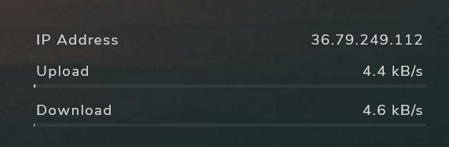

<!--
*** Thanks for checking out the Best-README-Template. If you have a suggestion
*** that would make this better, please fork the repo and create a pull request
*** or simply open an issue with the tag "enhancement".
*** Thanks again! Now go create something AMAZING! :D
***
***
***
*** To avoid retyping too much info. Do a search and replace for the following:
*** fyfirman, minimalist-illustro-rainmeter, twitter_handle, fyfirman@gmail.com, project_title, project_description
-->

<!-- PROJECT SHIELDS -->
<!--
*** I'm using markdown "reference style" links for readability.
*** Reference links are enclosed in brackets [ ] instead of parentheses ( ).
*** See the bottom of this document for the declaration of the reference variables
*** for contributors-url, forks-url, etc. This is an optional, concise syntax you may use.
*** https://www.markdownguide.org/basic-syntax/#reference-style-links
-->

[![LinkedIn][linkedin-shield]][linkedin-url]

<!-- PROJECT LOGO -->
 

  <a href="https://github.com/fyfirman/questionnaire">
    <!--  -->
  </a>
  <h3 align="center">MINIMALIST ILLUSTRO</h3>
    
  

    Custom illustro raimeter skin with minimalist design
     
     
     
    <a href="https://github.com/fyfirman/minimalist-illustro-rainmeter">View Demo</a>
    ·
    <a href="https://github.com/fyfirman/minimalist-illustro-rainmeter/issues">Report Bug</a>
    ·
    <a href="https://github.com/fyfirman/minimalist-illustro-rainmeter/issues">Request Feature</a>
  

<!-- TABLE OF CONTENTS -->

  
Table of Contents

  <ol>
    <li>
      <a href="#about-the-project">About The Project</a>
    </li>
    <li>
      <a href="#getting-started">Getting Started</a>
      <ul>
        <li><a href="#prerequisites">Prerequisites</a></li>
        <li><a href="#installation">Installation & Usage</a></li>
      </ul>
    </li>
    <li><a href="#contributing">Contributing</a></li>
    <li><a href="#license">License</a></li>
    <li><a href="#contact">Contact</a></li>
  </ol>

<!-- ABOUT THE PROJECT -->

## About The Project

### Network

### Network

<!-- GETTING STARTED -->

## Getting Started

### Prerequisites

- Rainmeter (download [here](https://www.rainmeter.net/))

### Installation & Usage
<!-- TODO: Update release page -->
1. Download rmskin pack from (realease page)[https://github.com]
2. Open and install rmskin pack
3. Load skin everything you want 

<!-- CONTRIBUTING -->

## Contributing

Contributions are what make the open source community such an amazing place to be learn, inspire, and create. Any contributions you make are **greatly appreciated**.

1. Fork the Project
2. Create your Feature Branch (`git checkout -b feature/AmazingFeature`)
3. Commit your Changes (`git commit -m 'Add some AmazingFeature'`)
4. Push to the Branch (`git push origin feature/AmazingFeature`)
5. Open a Pull Request

<!-- LICENSE -->

## License

Distributed under the MIT License. See `LICENSE` for more information.

Template README by [Best-README-Template](https://github.com/othneildrew/Best-README-Template)

<!-- CONTACT -->

## Contact

Firmansyah Yanuar - [@fyfirman](https://instagram.com/fyfirman) - fyfirman@gmail.com

Project Link: [https://github.com/fyfirman/minimalist-illustro-rainmeter](https://github.com/fyfirman/minimalist-illustro-rainmeter)

<!-- MARKDOWN LINKS & IMAGES -->
<!-- https://www.markdownguide.org/basic-syntax/#reference-style-links -->

[linkedin-shield]: https://img.shields.io/badge/-LinkedIn-black.svg?style=for-the-badge&logo=linkedin&colorB=555
[linkedin-url]: https://linkedin.com/in/fyfirman
